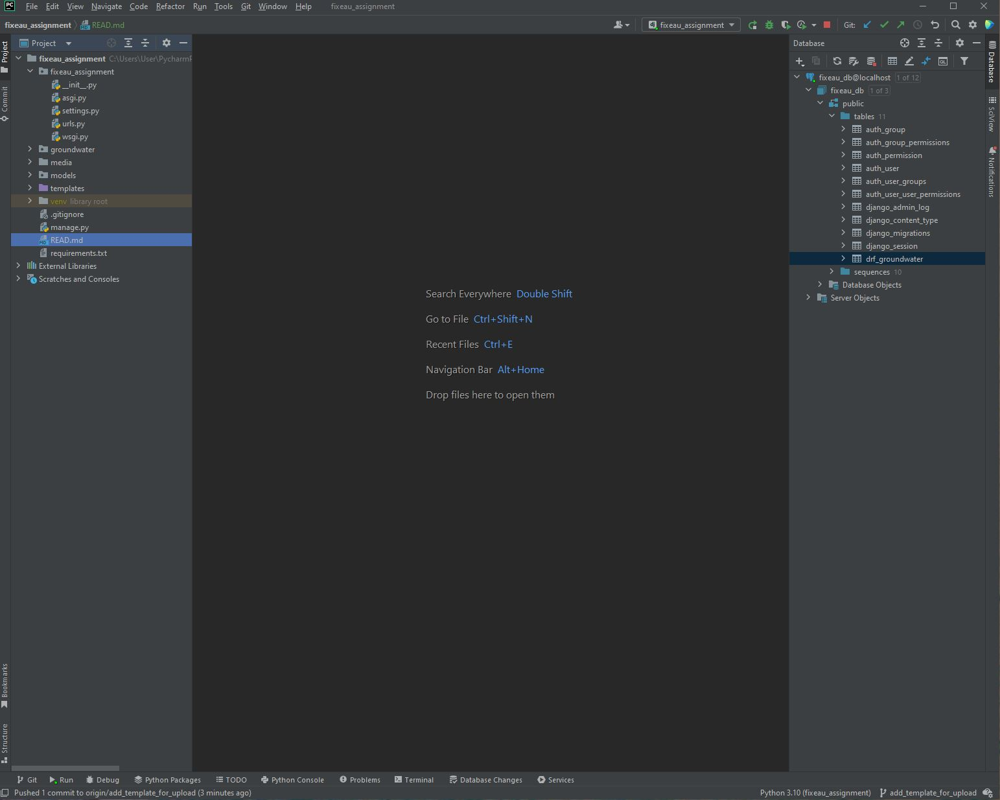
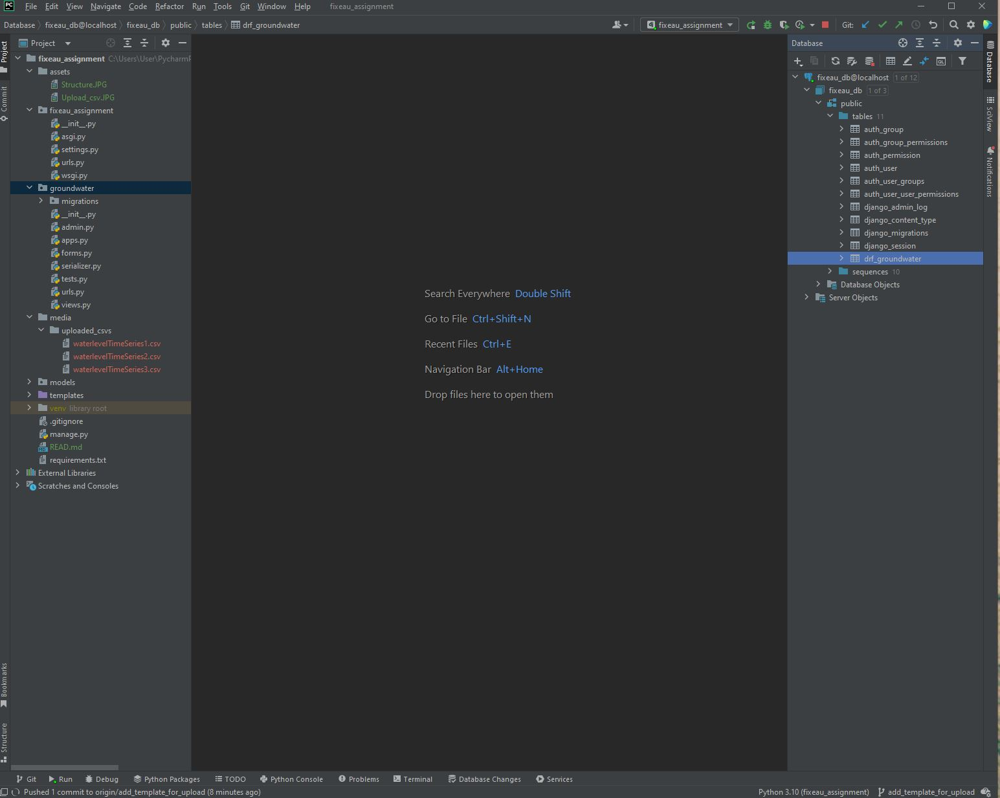

**Developer assignment Fixeau**  
This assignment combines Django knowledge and data analysis. The attached csv’s contain timeseries  
that show measurements of groundwater level in meters, relative to a height standard known as NAP.  
The groundwater level can also be measured with respect to the ground level at that measurement  
device, so if the ground level is 1 meter lower than NAP, -1 mNAP, the measurements with respect to  
the ground level would shift 1 meter up.  
Create a Django app that can do the following:  

*• Create an API call that can*  
1. Read in the three csv’s attached in the mail and combines them  
2. Remove outliers from the combined data  
3. Insert the data into a table  
*• Create an API call that:*  
1. Returns the data from the table  
2. Contains a ground level query parameter that returns the data relative to this ground  
level  
*• Create a simple webform that has a text field where the ground level can be entered and a  
button that when clicked shows the data created by the last API. Note: do not try to make the  
page look very fancy or nice.*

**Details for Project**

***Initialize and run project***

 **1. Clone the repository:**
 
git clone https://gitlab.com/denisakita10/fixeau_assignment.git

 **2. Install Dependencies:**
 
pip install -r requirements.txt

 **3. Change the data for your local database in settings.py:**

DATABASES = {

    'default': {
    
        'ENGINE': 'django.db.backends.postgresql',
        
        'NAME': 'your_database_name',
        
        'USER': 'your_database_user',
        
        'PASSWORD': 'your_database_password',
        
        'HOST': 'your_database_host',
        
        'PORT': 'your_database_port',
        
    }
}

 **4. Set Up the Database:**

python manage.py makemigrations

python manage.py migrate

 **5. Create a Superuser (if needed):**

python manage.py createsuperuser

 **6. Run the Development Server:**

python manage.py runserver

 **7. Access the Project:**
 
API: http://127.0.0.1:8000/

Django admin interface (if you created a superuser): http://127.0.0.1:8000/admin/

> **DRF project should now be up and running :)
